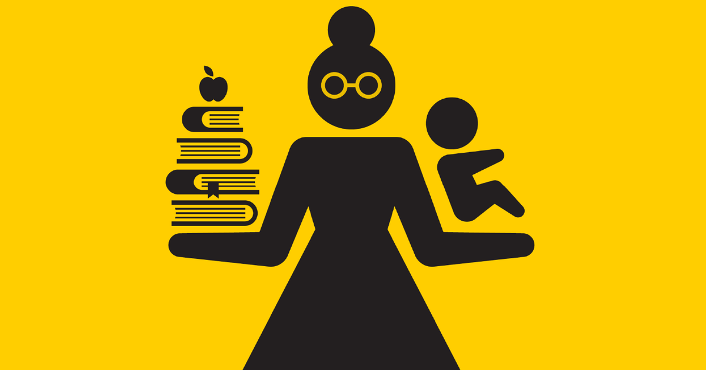

<h1 align="center"> Educação e Maternidade - Projeto Final {Reprograma}  

## Curso de Python Projeto 'Análise de Dados' | Turma On26 da [{Reprograma}](https://www.reprograma.com.br/) 

<br> 
<!-- o <br> pula uma linha, como o enter -->

<p align="center">

</p>
<!-- dessa forma acima voce coloca imagens, gifs e afins, e pode manipular o tamanho, e esta centralizado -->
<!-- pode fazer dessa forma tbm  vai ficar centralizado mais sem manipulação de tamanho -->


- [Descrição do Projeto](#-descrição-do-projeto) 
- [Motivaçãoo](#-Motivação) 
- [Funcionalidades](#-Funcionalidades) 
- [:woman_technologist: Tecnologias e Dependências Utilizadas](#woman_technologist-tecnologias-e-dependências-utilizadas) 
- [:clinking_glasses: Agradecimentos](#clinking_glasses-agradecimentos) 
- [:art: Autora](#art-autora)

 
# Descrição do Projeto

Este projeto visa analisar a situação educacional das mães e como a falta de apoio e informações por parte das instituições de ensino pode impactar suas decisões de desistir ou adiar os estudos. Nosso objetivo é entender esses desafios e propor maneiras de encorajar e apoiar as mulheres a concluírem seus estudos.

# Motivação

Muitas mães enfrentam obstáculos significativos ao tentar equilibrar a maternidade e a busca por uma educação mais elevada. A falta de suporte e informações adequadas por parte das instituições de ensino pode contribuir para a desistência ou o adiamento dos estudos. Este projeto busca lançar luz sobre essas questões e encontrar soluções para incentivar as mães a perseguirem seus objetivos educacionais.

# Funcionalidades

1. **Análise de Dados:**
   - Coleta e análise de dados sobre a educação de mães, incluindo taxas de desistência e razões para adiamento.

2. **Identificação de Desafios:**
   - Identificação dos principais desafios que as mães enfrentam em relação à educação.

3. **Propostas de Soluções:**
   - Desenvolvimento de propostas para superar os desafios identificados.

4. **Conscientização e Apoio:**
   - Incentivo à conscientização sobre a importância do apoio educacional para mães.
   - Desenvolvimento de recursos e programas de apoio.


# :woman_technologist: Tecnologias e Dependências Utilizadas

<br>

<!-- Desse jeito vai fazer a tabela.  o `texto` vai marcar.-->

| Ferramenta | Descrição |
| --- | --- |
| `python` | Linguagem de programação. |
| `pandas`    | Biblioteca criada para a linguagem Python para manipulação e análise de dados.|
| `numpy`    | Biblioteca para a linguagem Python, que suporta o processamento de grandes, multi-dimensionais arranjos e matrizes. |
| `matplotlib`   | Biblioteca de software para criação de gráficos e visualizações de dados em geral, feita para e da linguagem de programação Python.|
| `seaborn`   |	Ferramenta para plotagem dos mais variados tipos de gráficos em Python.|
| `jupyter notebook`| Aplicação web criada para desenvolver software de código aberto, padrões abertos e serviços para computação interativa em dezenas de linguagens de programação.|
| `Tableau`    | Plataforma de análise, exploração e gerenciamento de dados visuais.|


```py <!-- colocando o py, fica um pouquinho colorido, pode testar com outras linguagens tbm-->
# Clonar o repositório
$ git clone https://github.com/DamarisSantos/Projeto-Final-Reprograma

# Entrar na pasta do repositório
$ cd nome da pasta

# Instalar as bibliotecas
$ import pandas as pd
$ import numpy as np
$ import matplotlib.pyplot as plt
$ import seaborn as sns

# Executar o comando na parte superior do arquivo em .ipynb para que você possa rodar o projeto localmente no arquivo 'analise_projeto.ipynb'.
$ Run ou Run All
```
# Agradecimentos

Expresso minha profunda gratidão à minha amiga Verônica, cujo papel foi fundamental em minha decisão de ingressar no mundo da programação, indicando-me a Reprograma. À Reprograma, que não apenas abriu as portas para mim, mas também me recebeu calorosamente, em especial a Jani, Mayhara, Juliana, Loui, e todas as professoras e mentoras que contribuíram para a minha jornada. Agradeço imensamente ao meu marido, cujo apoio e compreensão foram fundamentais nesse processo. À minha mãe, que, mesmo tendo estudado apenas até a 4ª série, foi uma das mulheres mais inteligentes que já conheci. Ela criou sozinha cinco filhos, sendo quatro mulheres, que hoje, graças aos seus ensinamentos, são mulheres formadas. Acima de tudo, expresso minha gratidão a Deus.

# :art: Autora

Desenvolvido por Damaris Santos
<p align="center"> clique >> <a href="https://www.linkedin.com/in/damaris-santos-15b810240/" target="_blank"></a> </p>


